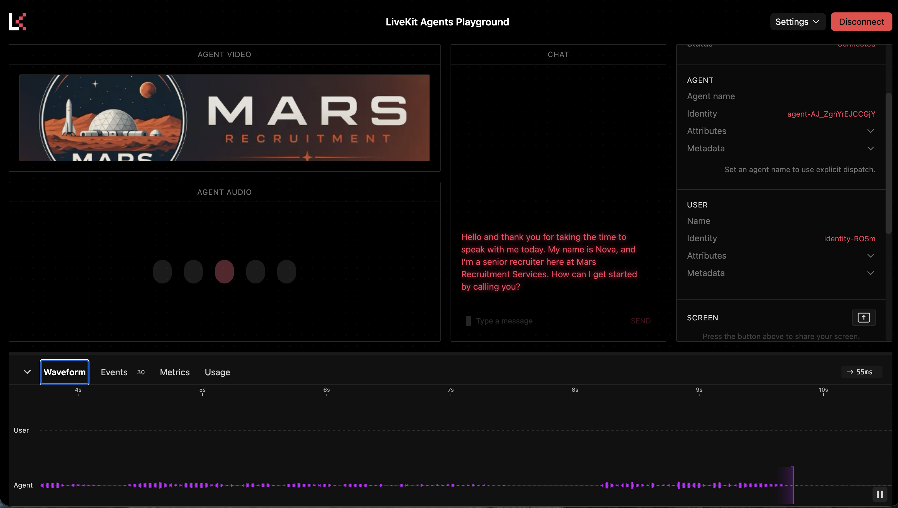

# Mars Recruitment Services — Voice Screening Agent




---

A LiveKit Agents demo that conducts a first-round phone screening for
prospective Mars settlers using Simplismart inference. The agent greets the candidate, discusses
open mission roles from the catalog, runs two short interview questions
(background, motivation for Mars), and closes warmly. The voice loop is
intentionally simple — a single `Agent` with one system prompt, no
function tools, no task groups.

After the call ends, the full transcript is sent to an evaluation LLM
once to produce a structured JSON evaluation (executive summary,
recommendation, score, strengths/concerns, per-question notes). That
evaluation is rendered into a rich markdown report at
`./reports/interview_<date>_<time>_<sessionId>.md` and, if configured,
appended as a row to a Google Sheet. The post-call pipeline lives in
`report_gen.py` so the agent file stays focused on the voice loop.

## Project layout

```
interview_agent.py   # the agent (entrypoint + voice loop)
report_gen.py        # post-call transcript → evaluation → markdown + sheets
google_sheets.py     # Google Sheets writer (service-account auth)
mars_jobs.json       # catalog of open Mars mission roles
res/                 # mission-patch image used in reports
reports/             # generated markdown interview reports (gitignored)
env.example          # sample .env — copy to .env.local and fill in
```

## Prerequisites

- Python 3.11+ (Python 3.13 tested)
- A LiveKit Cloud project — credentials at https://cloud.livekit.io/projects/p_/settings/keys
- A Simplismart API key for STT / LLM / TTS — https://app.simplismart.ai/settings?tab=2
- (Optional, for Google Sheets output) A Google Cloud project you admin,
  a service-account JSON key, and `gcloud` to set them up. See
  [Google Sheets](#google-sheets-optional) below. The agent writes the
  local markdown report regardless.

## Setup

### 1. Python virtual env

```bash
python -m venv .venv
source .venv/bin/activate
pip install -U pip
pip install -r requirement.txt
```

### 2. Environment variables

Copy `env.example` to `.env.local` and fill in the required values:

```bash
cp env.example .env.local
```

Required:

```
SIMPLISMART_API_KEY=eyJhb...
LIVEKIT_URL=wss://<your-project>.livekit.cloud
LIVEKIT_API_KEY=API...
LIVEKIT_API_SECRET=...
```

Optional — per-service model overrides. Set only the ones you want to
change; unset vars fall back to the defaults shown below (from
`interview_agent.py` and `report_gen.py`).

```
# Conversational STT / LLM / TTS (Simplismart, by default).
STT_URL=https://api.simplismart.live/predict
STT_MODEL=openai/whisper-large-v3-turbo

LLM_URL=https://api.simplismart.live
LLM_MODEL=meta-llama/Meta-Llama-3.1-8B-Instruct

TTS_URL=https://api.simplismart.live/tts
TTS_MODEL=canopylabs/orpheus-3b-0.1-ft
TTS_VOICE=                 # optional; model-specific

# Post-call evaluation LLM (independent of the conversational LLM).
# Defaults to Simplismart's gpt-oss-120b.
EVAL_LLM_URL=https://api.simplismart.live
EVAL_LLM_MODEL=openai/gpt-oss-120b

# Google Sheets output. Both required to write rows; see the section
# below for setup. The agent always writes local markdown regardless.
GOOGLE_APPLICATION_CREDENTIALS=/path/to/service-account.json
GOOGLE_SHEETS_SPREADSHEET_ID=
```

TTS plugin is selected from the URL: endpoints ending in `/audio/speech`
go through `openai.TTS` (OpenAI-compatible); everything else uses
`simplismart.TTS` (native `/tts`). Swap TTS stacks by flipping `TTS_URL`.

## Running

Dev mode (auto-reload, prints a playground connection URL + token on
startup):

```bash
python interview_agent.py dev
```

Console mode (run the agent in the terminal without LiveKit rooms, for
quick local testing):

```bash
python interview_agent.py console
```

Production-style start (no reload):

```bash
python interview_agent.py start
```

Connect the test client at [https://agents-playground.livekit.io/](https://agents-playground.livekit.io/#cam=1&mic=1&screen=1&video=0&audio=1&chat=1&theme_color=rose) 


## Google Sheets (optional)

In addition to the local markdown report in `./reports/`, each completed
interview is appended as a row to a Google Sheet when configured.
Authentication uses a **Google Cloud service account JSON key**, picked
up automatically via `GOOGLE_APPLICATION_CREDENTIALS`. `google.auth.default()`
detects the env var and hands the service-account credentials to gspread.

If Sheets isn't configured, the agent still writes the markdown report
locally and logs a warning — only the sheet row is skipped.

### One-time setup

You'll need a Google Cloud project you have **admin** on project to 
create service accounts. If you don't have a personal one, create one at
https://console.cloud.google.com/projectcreate (or reuse an existing
personal project).

#### 1. Install and authenticate gcloud

```bash
# macOS
brew install --cask google-cloud-sdk
# or follow https://cloud.google.com/sdk/docs/install

gcloud auth login     # opens a browser — sign in as yourself
gcloud projects list  # confirm your project appears
gcloud config set project <your-project-id> 
```

> Do **not** use the project *number* here — use the project **id**
> (the string-y one in the first column of `gcloud projects list`).

#### 2. Enable the Sheets + Drive APIs on that project

```bash
gcloud services enable sheets.googleapis.com drive.googleapis.com
```

Or via the console:
- https://console.cloud.google.com/apis/library/sheets.googleapis.com
- https://console.cloud.google.com/apis/library/drive.googleapis.com

Confirm the project selector in the top bar matches your project before
clicking **ENABLE**.

#### 3. Create a service account and download its key

```bash
PROJECT_ID=$(gcloud config get-value project)

gcloud iam service-accounts create mars-interview \
  --display-name="Mars Interview Writer"

SA_EMAIL="mars-interview@${PROJECT_ID}.iam.gserviceaccount.com"

mkdir -p ~/.config/gcp
gcloud iam service-accounts keys create ~/.config/gcp/mars-interview-sa.json \
  --iam-account="$SA_EMAIL"

echo "Share your sheet with: $SA_EMAIL"
```

The key file lives at `~/.config/gcp/mars-interview-sa.json`. Treat it
like a password — it's not checked in, but don't paste it anywhere.

#### 4. Share the target Google Sheet with the service account

Service accounts act as themselves, so the sheet must explicitly grant
them access:

1. Open the sheet you want results written to.
2. Click **Share** in the top right.
3. Paste the `mars-interview@…iam.gserviceaccount.com` email from the
   previous step.
4. Role: **Editor**.
5. Uncheck "Notify people" (service accounts can't read email).
6. Click **Share**.

#### 5. Configure this project

Add to `.env.local`:

```
GOOGLE_APPLICATION_CREDENTIALS=/Users/<you>/.config/gcp/mars-interview-sa.json
GOOGLE_SHEETS_SPREADSHEET_ID=<the long segment from the sheet URL>
```

The spreadsheet id is the long alphanumeric part of
`https://docs.google.com/spreadsheets/d/<THIS_PART>/edit`.

#### 6. Verify

```bash
.venv/bin/python scripts/check_sheets.py
```

Expected output: `read ok — first tab: Sheet1` (or whatever your first
tab is named).

On the next `python interview_agent.py dev` run you should see
`Google Sheets service initialized successfully` in the logs. A
worksheet named `Interview Results` is created automatically on first
write with columns: Timestamp, Session ID, Candidate Name, Score (1-10),
Recommendation, Strengths, Areas for Improvement, Summary, Full
Conversation.


### Troubleshooting

- **403 "Google Sheets API has not been used in project X…"** — The
  Sheets API isn't enabled on the project that owns the service account.
  Re-run step 2 for that project.
- **403 "The caller does not have permission"** — The sheet isn't shared
  with the service-account email, or it was shared as Viewer instead of
  Editor. Re-run step 4.
- **"serviceusage.services.list" permission denied** — You don't have
  admin on that project (typical for org-managed projects like
  `livekit-cloud-site`). Use a personal project instead.
- **`gcloud` is acting as a service account** (`gcloud auth list` shows a
  `*.iam.gserviceaccount.com` as ACTIVE) — run `gcloud auth login` again
  as your user.

## Swapping models

Change one `*_URL` / `*_MODEL` / `*_VOICE` line in `.env.local` and
restart the agent. Each service is independent.

The **conversational** LLM (`LLM_URL` + `LLM_MODEL`) is Simplismart by
default, which prioritizes latency.

The **post-call evaluation** LLM (`EVAL_LLM_URL` + `EVAL_LLM_MODEL`) is
independent and defaults to Simplismart's `openai/gpt-oss-120b` at
`https://api.simplismart.live`. Override either env var in `.env.local`
to point at a different OpenAI-compatible endpoint/model. Uses
`SIMPLISMART_API_KEY`. No latency constraint here, so using a bigger
model than the conversational one is fine.

Changing one LLM does not affect the other.


## LiveKit docs

This project follows the [LiveKit Agents](https://docs.livekit.io/agents/)
conventions. The `lk docs` CLI and the LiveKit Docs MCP server are the
fastest way to look up current API details — see `AGENTS.md` for
install instructions and usage.
